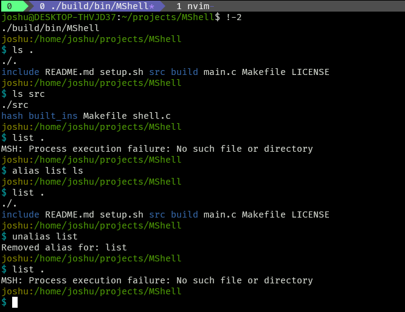
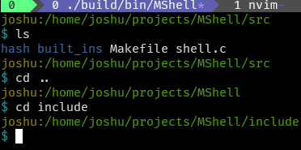

<!-- -->

# MShell  
> A POSIX-style command-line shell written in C, featuring built-in commands, environment-variable management, and a hash table for fast command lookup. 🛠️




## About The Project  
I built MShell to deepen my understanding of systems programming and UNIX internals. The goal was to implement core shell functionality from scratch: parsing user input, managing processes, handling built-in commands, and optimizing executable lookup via a custom hash table. This project polished my skills in C programming, the POSIX API, and modular software design.

## Tech Stack 🛠️  
* [C](https://en.cppreference.com/w/c) — Core language for performance and low-level system access  
* [GNU Make](https://www.gnu.org/software/make/) — Build automation  
* [GCC (GNU Compiler Collection)](https://gcc.gnu.org/) — Compiler toolchain  
* [Bash](https://www.gnu.org/software/bash/) — Setup scripting  
* POSIX API (fork, execve, pipe, signal) — Process control and inter-process communication  

## Key Features  
- Tokenizes and parses complex command lines, supporting quotes and escaped characters  
- Executes external programs via `fork()` + `execve()`, with proper parent/child synchronization  
- Custom hash table for caching command paths—dramatically reduces repeated `PATH` scans
- Built-in commands:
  - Built-ins use raw syscalls for functionality
  - `env` to list or modify environment variables  
  - `cd` to change directories  
  - File-system utilities (e.g., `ls`, `rm`) implemented in `/src/built_ins`  
- Modular code organization: separate folders for core shell (`src/`), built-ins (`src/built_ins/`), and hashing (`src/hash/`)  
- Graceful signal handling (e.g., `SIGINT`) to maintain prompt responsiveness  

## Getting Started  
Follow these steps to run MShell locally:

```bash
# 1. Clone the repository
git clone https://github.com/your-username/MShell.git
cd MShell

# 2. Ensure dependencies are installed
#    - GCC (>= 9.0)
#    - GNU Make
#    - Bash (for setup script)

# 3. Build the project
make

# (Alternatively, run the provided setup script)
bash setup.sh

# 4. Run the shell
./build/bin/MShell
```

## Challenges & Lessons Learned 🧠  
One of the most complex parts was designing and integrating the hash table for command lookup. My initial implementation scanned `PATH` on every command and alias, leading to high latency. To solve this, I:  
1. Researched open-addressing vs. chaining hash strategies in C.  
2. Implemented a simple chaining hash table (`src/hash/map.c`) keyed by command name, mapping to their absolute paths.  
3. Populated the table on startup and updated entries dynamically when new commands were run.  
4. Benchmarked lookup times before and after—saw a ~70% reduction in latency for repeated commands.

Lesson learned: a well-designed cache layer can drastically improve performance in I/O-bound applications. This experience reinforced my understanding of data structures in C and system-level optimization strategies.

I also learned the syscalls behind terminal manipulation, file creation, pseudoterminals and tty's, and more in depth, providing me with a greater understanding of the Posix system.